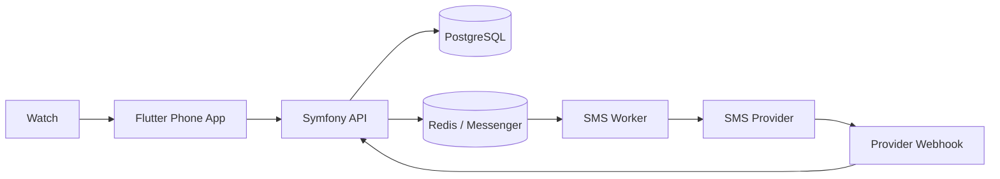
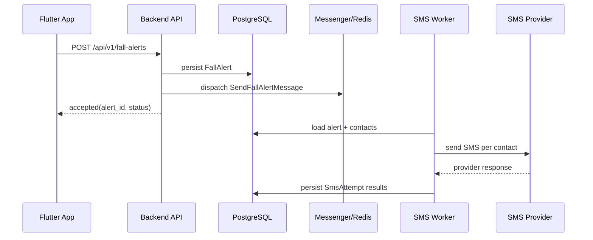
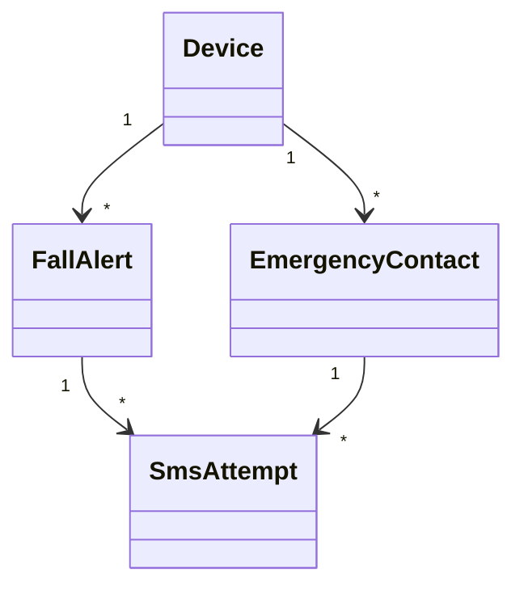
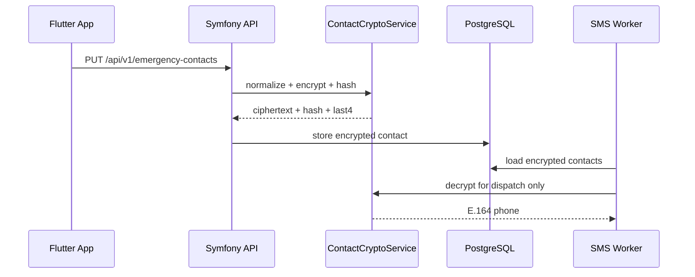

# Fall Guardian Backend

Symfony/API Platform backend for server-side emergency SMS escalation.

## Purpose

This service receives fall timeout events from the phone app and becomes the
source of truth for:

- device identity
- emergency contacts
- alert intake and idempotency
- SMS dispatch and delivery tracking

It does not handle:

- fall detection
- watch ↔ phone real-time sync
- countdown UI
- caregiver/admin dashboards

## Production Goals

- reliable SMS delivery with async workers
- simple device-token identity, no user accounts
- minimal persisted state with auditability
- idempotent alert intake and duplicate suppression
- encrypted contact storage

## Tech Stack

- Symfony 7.4
- API Platform 4.3
- Doctrine ORM + Migrations
- PostgreSQL
- Symfony Messenger + Redis
- FrankenPHP
- Twilio SDK

Quality tools mirrored from Signalist:

- PHPUnit
- PHPStan
- PHP-CS-Fixer
- Rector
- GrumPHP
- Behat

## Architecture Overview

The backend is intentionally pragmatic:

- API Platform resources/DTOs cover device registration, contact sync, and
  alert command endpoints where that stays readable.
- Application services own crypto, normalization, idempotency, and alert
  orchestration.
- Messenger workers own SMS delivery so the HTTP request path stays short.

Subsystems:

- Device registration
- Contact storage and encryption
- Alert ingestion
- SMS dispatch
- Provider webhook reconciliation

## Diagrams

### System Context



### Alert Timeout Sequence



### Domain Model



### Contact Encryption Flow



## API Overview

### Public endpoints

- `POST /api/v1/devices/register`
- `PUT /api/v1/emergency-contacts`
- `POST /api/v1/fall-alerts`
- `POST /api/v1/fall-alerts/{clientAlertId}/cancel`
- `GET /api/v1/fall-alerts/{id}`
- `POST /webhooks/sms/twilio`
- `GET /health`

### Auth model

- `POST /api/v1/devices/register` is public.
- All `/api/v1/*` device endpoints require `Authorization: Bearer <device_token>`.
- The backend stores only the token hash.

### Example payloads

Device registration:

```json
{
  "platform": "ios",
  "appVersion": "1.0.0"
}
```

Contact replacement:

```json
{
  "contacts": [
    {
      "id": "local-contact-1",
      "name": "Alice",
      "phone": "+33612345678"
    }
  ]
}
```

Alert creation:

```json
{
  "clientAlertId": "fall-2026-04-09T12:00:00Z",
  "fallTimestamp": "2026-04-09T12:00:00+00:00",
  "locale": "fr",
  "latitude": 48.8566,
  "longitude": 2.3522
}
```

## Security Model

- device bearer token auth
- hashed device tokens in the database
- encrypted contact storage
- HMAC hash for contact deduplication
- masked phone suffix for logs and support traces
- no plaintext phone numbers in logs, DB, or API responses

## Local Development

### Prerequisites

- Docker + Docker Compose
- PHP 8.5 for local Composer usage if you are not using containers

### Commands

```bash
cd backend
make install
make up
make migrate
make test
make quality
```

### Common workflows

```bash
make shell
make logs
make logs-messenger
make messenger-consume
make routes
```

Key local URLs:

- API docs: `http://localhost:8002/docs`
- Device/API endpoints: `http://localhost:8002/api/v1/...`

## Operational Notes

- SMS sending is async through Messenger workers.
- Delivery is high reliability, not guaranteed; carrier filtering and handset
  availability still apply.
- Webhook callbacks are required to reconcile final provider statuses.
- Cleanup should periodically purge old alert/send records according to the
  retention policy.
- The backend stores only the minimal state needed for reliability:
  devices, contacts, alerts, and SMS attempts.

## Future Roadmap

- optional user accounts
- second SMS provider
- admin console
- voice escalation
- contact ownership beyond a single device
