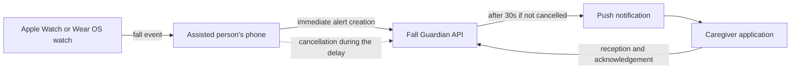
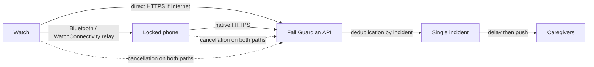

# Fall Guardian — functional and technical documentation

> Reference status as of July 25, 2026.
>
> This document separately describes what exists on `main`, known
> limitations, and what remains to be built. It is the product and
> architecture source of truth for the project, including the merged-PR
> changelog (§11) and phased roadmap (§14). The current handoff state and
> single next actionable task live in `CURRENT_STATUS.md` instead — update
> there, not here. The watch-enrollment contract and its PR breakdown live
> in `docs/COMPANION_ENROLLMENT.md`.

## 1. Product goal

Fall Guardian helps a person at risk of falling and their caregivers.

The system must:

1. detect a possible fall from an Apple Watch or a Wear OS watch;
2. immediately alert the person and give them a short window to indicate
   that they are okay;
3. transmit the incident even if the phone is locked and the application
   is not displayed;
4. notify caregivers if the incident is not cancelled;
5. show caregivers the incident's status and who is handling it;
6. keep a reliable history.

Fall Guardian does not replace native Apple/Android emergency-services
calling functions. As of today, the application notifies registered
caregivers; it does not automatically call emergency services and does
not send SMS messages.

## 2. Legend

| Marker | Meaning |
| --- | --- |
| ✅ | Available on `main` |
| 🟡 | Developed in an open pull request, not yet on `main` |
| 🔴 | To be implemented |
| ⚠️ | Known limitation or risk |

## 3. Overview

### Current system



The watch detects the fall, then transmits the event to the phone. The
assisted person's application immediately registers the alert on the
server. The server keeps a 30-second cancellation window. When it
expires, it notifies the caregivers linked to the person.

This path works well when the phone's Flutter code can start and reach
the server. It does not yet offer all the guarantees required when the
application is stopped, after a restart, or when the watch is alone.

### Target architecture



The watch will attempt two paths with the same incident identifier:

- direct submission if it has Wi-Fi or a cellular connection;
- relay through the phone if it is in range and has Internet.

The first submission received will create the incident. Subsequent ones
will be deduplicated. Opening the application must never be necessary.

## 4. Components

| Component | Technology | Role |
| --- | --- | --- |
| Assisted person application | Flutter, iOS and Android | Configuration, watch event reception, alert status, cancellation, local history |
| Caregiver application | Flutter, iOS and Android | Linking with a person, push reception, active alerts, history, acknowledgement |
| Apple Watch | Swift/watchOS | Fall detection, local interface, transmission to the iPhone |
| Wear OS watch | Kotlin/Wear OS | Accelerometer-based detection, local interface, transmission to the Android phone |
| API | Symfony 7.4, API Platform, PostgreSQL | Identities, links, incidents, cancellation delay, notifications, and history |
| Notifications | Firebase Cloud Messaging | Transmitting alerts to caregivers' phones |

## 5. Current features

### 5.1 Assisted person application

- ✅ secure phone registration with the API;
- ✅ reception of a fall event from the watch;
- ✅ creation of a unique `clientAlertId`;
- ✅ immediate alert registration with the server;
- ✅ local 30-second countdown;
- ✅ local cancellation and cancellation request to the server;
- ✅ deferred addition of GPS location once available;
- ✅ local retry if the first registration fails;
- ✅ countdown resumption after the Flutter timer is suspended;
- ✅ local history of detections and their outcome;
- ✅ explicit retention of a cancellation not confirmed by the server;
- ✅ display of a warning if caregivers may already have been notified;
- ✅ creation of a companion enrollment and versioned transmission to the
  associated watch from settings;
- ⚠️ location is not required to create the alert: it can arrive later;
- ⚠️ old Android text still mentions an SMS, even though no SMS is sent;
- ⚠️ the network relay to the API still depends on Flutter.

Since the merge of
[#74](https://github.com/thlaure/Fall-Guardian/pull/74), a second event
no longer restarts the delay while an incident is active. The same
deadline is kept despite duplicate events.

### 5.2 Caregiver application

- ✅ secure registration of the caregiver phone;
- ✅ registration of the push notification token;
- ✅ linking to a person via an invite code;
- ✅ support for multiple assisted persons;
- ✅ durable storage of received notifications;
- ✅ deduplication of the same alert presented multiple times;
- ✅ active alert screen;
- ✅ sending a receipt to the server;
- ✅ acknowledging an alert;
- ✅ alert history;
- ✅ list of followed people;
- ✅ resumption of notifications received before the interface opens;
- ⚠️ the screen still shows raw coordinates and a technical identifier;
- ⚠️ "Acknowledge" does not clearly mean "I am taking charge";
- ⚠️ the first acknowledgement globally closes the alert without clearly
  showing which caregiver is responding.

Since the merge of
[#73](https://github.com/thlaure/Fall-Guardian/pull/73), history loading
works after an error followed by a retry.

### 5.3 Apple Watch

On `main`:

- ✅ use of `CMFallDetectionManager`, Apple's system mechanism;
- ✅ activation at watchOS extension startup;
- ✅ possible reception of a fall in the background;
- ✅ persistence and retry of an event that was not transmitted;
- ✅ custom detection with the accelerometer as a fallback when the app
  is open;
- ✅ real-time transmission to the iPhone with WatchConnectivity;
- ✅ deferred transfer if the real-time message does not go through;
- ✅ countdown and cancellation on the watch;
- ✅ retransmission of the cancellation to the iPhone;
- ✅ integration of the Watch target into the main iOS project;
- ⚠️ a simple tap can cancel, which favors accidental cancellations;
- ⚠️ no direct submission to the API;
- ⚠️ Apple approved the Fall Detection capability (2026-07-25); physical
  installation still needs the capability configured in the Xcode project
  and refreshed provisioning profiles;
- ⚠️ exact behavior of Apple resolutions still to be validated on a real
  watch.

These features joined `main` with
[#75](https://github.com/thlaure/Fall-Guardian/pull/75).

### 5.4 Wear OS watch

- ✅ foreground service to continuously monitor the accelerometer;
- ✅ detection based on free fall, impact, and tilt change;
- ✅ service restart after the watch boots;
- ✅ countdown and local cancellation;
- ✅ immediate message to the Android phone;
- ✅ urgent data persisted in the Data Layer as a fallback;
- ⚠️ no direct submission to the API;
- ⚠️ if the phone app's process is killed, Android may show a
  notification, but server registration still waits for the Flutter
  activity to start.

### 5.5 API and server

- ✅ distinct identity for the assisted person's phone and the
  caregiver's phone;
- ✅ stable protected person identity shared across their devices;
- ✅ linking multiple phones or watches to the same person;
- ✅ authentication via device token, stored as an HMAC hash;
- ✅ secure watch enrollment with a token limited to five minutes, bound
  to `watchos` or `wearos` and usable only once;
- ✅ credentials specific to each watch, without copying the phone's
  token;
- ✅ invitations and links between assisted persons and caregivers;
- ✅ idempotent alert creation for a person and a `clientAlertId`;
- ✅ deduplication of an incident received from multiple devices;
- ✅ 30-second server cancellation window;
- ✅ deferred dispatch scheduling with Symfony Messenger;
- ✅ cancellation before the deadline;
- ✅ deferred location addition;
- ✅ push sending to all linked active caregivers;
- ✅ tracking of a send attempt for each caregiver;
- ✅ incident statuses and history;
- ✅ idempotent push receipt;
- ✅ idempotent caregiver acknowledgement;
- ✅ planned 15-second delay for push reception;
- ✅ planned 60-second delay for acknowledgement;
- ⚠️ automatic escalation after these delays remains incomplete.

## 6. Current alert lifecycle

### 6.1 Detection and creation

1. The watch detects a possible fall.
2. It creates or transmits a fall timestamp.
3. The phone creates a `clientAlertId`.
4. The phone immediately sends the alert to the API, without waiting for
   the countdown to finish.
5. The server records:
   - the reception time;
   - the cancellation deadline, 30 seconds later;
   - the initial `received` state.
6. The server schedules processing after the deadline.
7. The location is added later if available.

The local countdown serves the interface and acts as a fallback if the
first call fails. It must not trigger a second registration if the
server already knows about the alert.

### 6.2 Cancellation

1. The person indicates that they are okay on the watch or the phone.
2. The local timers stop.
3. The phone requests cancellation from the server.
4. The server accepts only if the alert is still `received` and the
   deadline has not passed.
5. Without server confirmation, the interface keeps the
   `cancellationPending` state and warns that caregivers may be
   contacted.

A cancellation after the deadline must not be presented as a successful
cancellation. In the target architecture, it will become a "person is
safe" update.

### 6.3 Notification

1. When the delay expires, the server claims the alert for processing.
2. It looks up all active caregivers linked to the person.
3. It creates a send attempt per caregiver.
4. It transmits the notification via Firebase Cloud Messaging.
5. The alert becomes `sent`, `partially_sent`, or `failed`.
6. The caregiver app sends a receipt when it processes the notification.
7. A caregiver can acknowledge the alert.

A push provider accepting a message does not prove that the phone
received it. The app's receipt and handling are therefore two distinct
states.

## 7. Current server states

| State | Meaning |
| --- | --- |
| `received` | Alert created, still cancellable |
| `dispatching` | Sending to caregivers in progress |
| `sent` | All planned notifications were accepted by the provider |
| `partially_sent` | Some notifications failed |
| `failed` | No planned send succeeded |
| `cancelled` | Cancellation confirmed before the deadline |
| `acknowledged` | At least one caregiver acknowledged the alert |

Eventually, the interface will need to clearly distinguish:

```text
detected
→ registered on the server
→ cancelled
or
→ sent
→ received
→ handled
→ resolved
```

## 8. Connectivity and behavior

### Current behavior

| Situation | Current result |
| --- | --- |
| Watch in range, phone with Internet, apps active | Full path |
| Watch without Wi-Fi, phone in range with mobile network | Watch → phone relay possible |
| Locked iPhone, iOS app in background | Native wake-up observed on simulator; physical test required |
| Android phone app visible or process alive | Relay possible |
| Android process killed | Local notification possible, server creation not guaranteed |
| Watch alone with Wi-Fi/cellular | No direct submission today |
| No network on watch and phone | Transmission impossible; local event only |
| iPhone restarted before first unlock | WatchConnectivity may be delayed |
| App explicitly force-stopped | Reduced system guarantees |

The garden scenario, with the watch without Wi-Fi but the iPhone on the
person, must work as follows:

```text
watch
→ Bluetooth / WatchConnectivity
→ locked iPhone
→ iPhone's mobile network
→ server
```

Home Wi-Fi is not necessary. A cellular Apple Watch is only necessary if
the person can move away without their iPhone.

### Physical guarantee

No software can transmit if neither the watch nor the phone has a
network or radio path. In that case, the local alarm, persistence, and
retries are the only possible protections.

Apple's Fall Detection and Emergency SOS features remain a native safety
layer independent of Fall Guardian.

## 9. Data and security

### Identity

The server currently recognizes:

- a stable identity per protected person;
- `protected_person` devices linked to that identity;
- `watchos` and `wearos` watches linked to that same identity;
- `caregiver` devices;
- active links between them;
- caregivers' push tokens.

Authentication tokens are not stored in plaintext. Secrets, certificates,
signing profiles, and private Firebase files must never be added to the
repository.

### Incident contract

The creation contract now accepts:

```text
clientAlertId
fallTimestamp
cancelled: true | false
revision
detectionSource
resolution
locale
latitude and longitude (optional)
```

`revision`, `detectionSource`, and `resolution` remain optional to
preserve compatibility with already-installed applications. Their
default values are `1`, `assisted_phone`, and `unknown`, respectively.

The server notably returns:

```text
receivedAt
cancelDeadlineAt
```

Duplicates are identified by protected person + `clientAlertId`. A more
recent revision updates the incident's metadata without recreating the
alert or re-triggering the notification. A cancellation carrying a
revision older than the one already recorded is rejected. Caregivers and
history are found at the person level, even when the incident comes from
a different companion device.

The enrollment API now lets an authenticated phone create a single-use
token for a platform. The watch exchanges this token within five minutes
for its own `deviceId` and `deviceToken`. The server only stores the
HMAC hash of the enrollment token. An incorrect platform does not
consume it; an expired or already-used token is rejected. Integration of
this path is available on the phone side; its consumption still needs to
be implemented in the watchOS and Wear OS apps.

The detailed contract and the client implementation order are described
in [`COMPANION_ENROLLMENT.md`](COMPANION_ENROLLMENT.md).

All screens will need to use `cancelDeadlineAt` as the authoritative
deadline.

### Current API

Main endpoints:

```text
POST   /api/v1/devices/register
POST   /api/v1/companion-enrollments
POST   /api/v1/companion-enrollments/claim
POST   /api/v1/fall-alerts
GET    /api/v1/fall-alerts/{id}
POST   /api/v1/fall-alerts/{clientAlertId}/cancel
POST   /api/v1/fall-alerts/{clientAlertId}/location
POST   /api/v1/fall-alerts/{id}/receipt
POST   /api/v1/fall-alerts/{id}/acknowledge
POST   /api/v1/invites
POST   /api/v1/invites/{code}/accept
POST   /api/v1/caregiver/push-token
GET    /api/v1/caregiver/alerts
GET    /api/v1/caregiver/protected-persons
GET    /api/v1/protected/linked-caregivers
DELETE /api/v1/protected/linked-caregivers/{id}
GET    /health
```

Local OpenAPI documentation is accessible at
`http://localhost:8002/docs`.

## 10. What has been verified

- ✅ backend unit, integration, and Behat scenario tests;
- ✅ registration of both device types;
- ✅ invitations, acceptance, and invalid cases;
- ✅ idempotent alert creation;
- ✅ cancellation and coordinate validation;
- ✅ push distribution and history;
- ✅ idempotent receipts and acknowledgements;
- ✅ versioned incident contract and multi-device deduplication;
- ✅ creation and consumption of a secure companion enrollment;
- ✅ enrollment creation and transmission from the assisted person app;
- ✅ Flutter tests and static analysis of the mobile applications;
- ✅ Wear OS lint, tests, and build;
- ✅ watchOS analysis, build, and tests;
- ✅ simulated Watch → iPhone → Flutter chain;
- ✅ iPhone app launch/wake-up in the background observed on simulator;
- ⚠️ `transferUserInfo` and locked-phone behavior require real devices;
- ⚠️ Apple's system fall simulation runs into a Core Motion Simulator
  parsing error;
- ⚠️ Apple Fall Detection approval received (2026-07-25); physical
  validation itself remains untested.

## 11. Recently merged changes

| PR | Content | Functional status |
| --- | --- | --- |
| [#73](https://github.com/thlaure/Fall-Guardian/pull/73) | Reloading caregiver history after an error | ✅ Merged into `main` |
| [#74](https://github.com/thlaure/Fall-Guardian/pull/74) | Single delay for an active incident and iOS text fix | ✅ Merged into `main` |
| [#75](https://github.com/thlaure/Fall-Guardian/pull/75) | Background Apple detection | ✅ Merged into `main`, Apple approval received 2026-07-25, physical validation still pending |
| [#76](https://github.com/thlaure/Fall-Guardian/pull/76) | Functional documentation and target architecture | ✅ Merged into `main` |
| [#77](https://github.com/thlaure/Fall-Guardian/pull/77) | Versioned incident contract and server deadline | ✅ Merged into `main` |
| [#78](https://github.com/thlaure/Fall-Guardian/pull/78) | Stable identity and multi-device deduplication | ✅ Merged into `main` |
| [#79](https://github.com/thlaure/Fall-Guardian/pull/79) | Secure server-side watchOS and Wear OS enrollment | ✅ Merged into `main` |
| [#80](https://github.com/thlaure/Fall-Guardian/pull/80) | Client contract and watch integration plan | ✅ Merged into `main` |
| [#81](https://github.com/thlaure/Fall-Guardian/pull/81) | Enrollment creation and transmission from the assisted app | ✅ Merged into `main` |

The architecture changes below can now build on this common base.

## 12. Known issues

### Reliability

- 🔴 the watch does not contact the server directly;
- 🔴 native phone relays still depend on Flutter;
- 🔴 the Android killed-process case is not reliable;
- 🔴 the offline queue is not unified and durable end to end;
- 🔴 the watch apps do not yet consume the new companion enrollment;
- 🔴 the renotification policy when there is no caregiver response is
  incomplete;
- ⚠️ the delay's start time differs between some watch interfaces and
  the server;
- ⚠️ a late alert and a late cancellation do not yet have a rule shared
  by all components.

### Assisted person experience

- 🔴 replace the remaining Android text that mentions an SMS;
- 🔴 replace the single-tap cancellation with a large "I'm OK" button
  with an approximately 1.5-second long press and haptic feedback;
- 🔴 display useful states:
  "transmitting", "alert registered", "caregivers notified",
  "offline";
- 🔴 localize the watch screens;
- 🔴 clearly explain a cancellation that is too late;
- ✅ prevent a duplicate event from restarting the countdown.

### Caregiver experience

- 🔴 replace "Acknowledge" with understandable actions:
  "I've seen it", "I'm on it", "Person is safe",
  "Emergency services contacted";
- 🔴 show who is handling the incident;
- 🔴 display the location's name, map, address, accuracy, and time;
- 🔴 add call and directions actions;
- 🔴 update the location live on an already-open screen;
- 🔴 present the person's name before technical identifiers;
- 🔴 explain the lack of response and the retries.

### Product, security, and compliance

- 🔴 define and test the false-positive policy;
- 🔴 validate Apple resolutions on a physical watch:
  `rejected`, `unresponsive`, `dismissed`, `confirmed`;
- 🔴 clearly document that the service does not automatically contact
  emergency services;
- 🔴 finalize the data retention and deletion rules;
- 🔴 have the medical and emergency path validated before
  commercialization.

## 13. Detailed target architecture

### 13.1 Companion identity

The server now has a stable protected person identity and distinct
identities for its companion devices. Each watch must obtain its own
credentials via single-use enrollment. The phone's full token must never
be copied to the watch.

The server deduplicates on:

```text
protectedPersonId + clientAlertId
```

and no longer on:

```text
deviceId + clientAlertId
```

### 13.2 Dual transport

For each incident:

1. the watch persists the incident before any submission;
2. it immediately attempts HTTPS if Internet is available;
3. it attempts the relay to the phone in parallel;
4. the phone persists then sends with native code;
5. the server accepts the first message and deduplicates the others;
6. cancellation also takes both paths;
7. each component persists and retries until the server has confirmed.

Planned implementation:

- watchOS: `URLSession` + persistent queue + WatchConnectivity;
- iOS: native `URLSession` + persistent queue, independent of Flutter;
- Wear OS: direct HTTPS + Data Layer;
- Android: `WearableListenerService` + persistent/expedited native work.

### 13.3 Offline incidents

- fall not cancelled, received after the delay: immediate notification
  to caregivers;
- fall cancelled offline: history synchronization without notifying
  caregivers;
- messages received out of order: the highest revision wins;
- no network: local alarm, "offline" state, persistence, and retries.

### 13.4 Caregiver handling

Business state evolution:

```text
push sent
→ received by phone
→ seen by caregiver
→ taken over by an identified caregiver
→ person is safe or emergency services contacted
```

Proposed policy:

1. notify all caregivers;
2. wait for a receipt for 15 seconds, then retry if necessary;
3. without handling after 60 seconds, renotify and escalate;
4. inform the assisted person of the status;
5. never silently stop the escalation.

## 14. Implementation plan

### Phase 0 — stabilize the existing system

- ✅ PRs #73 to #81 merged after CI;
- fix the remaining Android SMS text;
- ✅ countdown preserved during duplicate events;
- test locked iPhone + real Apple Watch;
- test locked Android, killed process, and restart;
- record the results in this documentation.

### Phase 1 — server contract and model

- ✅ add the stable protected person identity and server support for
  multiple companion devices;
- ✅ create secure server-side watch enrollment: hashed token, limited to
  five minutes, bound to a platform, and usable only once;
- ✅ deduplicate by person + incident;
- ✅ add `revision`, `detectionSource`, and `resolution` without breaking
  older clients; `locale` already existed;
- ✅ return the authoritative server deadline;
- ⚠️ define rules for late and out-of-order events: newer revisions and
  older cancellations covered, full transitions still remaining;
- add unit, integration, and contract tests as increments progress.

### Phase 2 — native phone relay

- ✅ integrate enrollment creation into the assisted person app;
- ✅ transmit the ephemeral token to the associated watch;
- implement a persistent queue and native iOS transport;
- implement native Android reception and transport;
- transmit without opening Flutter;
- synchronize state to Flutter when it starts;
- cover locking, killed app, restart, and no network.

### Phase 3 — direct watch submission

- consume the enrollment and store credentials specific to each watch;
- add HTTPS submission and a persistent queue for watchOS;
- add HTTPS submission and a persistent queue for Wear OS;
- launch direct and relay submissions in parallel;
- synchronize creation, confirmation, and cancellation.

### Phase 4 — safety UX

- replace accidental cancellation with a long press;
- unify states and the deadline across watch and phone;
- clearly display connectivity;
- improve the caregiver screen, map, calls, and handling;
- localize all interfaces.

### Phase 5 — escalation and operations

- automate retries based on receipts and handling;
- add monitoring for stuck incidents and push failures;
- define metrics, logs, and technical alerts;
- test load, network loss, duplicates, and out-of-order delivery;
- finalize security, privacy, and compliance.

## 15. Minimum acceptance matrix

Each platform must cover at minimum:

| Scenario | Expected result |
| --- | --- |
| Watch with Internet, phone absent | Direct creation, single delay, notification |
| Watch without Internet, locked phone with Internet | Native relay, without opening the app |
| Simultaneous direct and relay | A single incident |
| Same fall transmitted multiple times | Same identifier and same deadline |
| Cancellation before the deadline | No caregiver notified |
| Cancellation received before an older fall message | The incident does not come back to life |
| Offline fall not cancelled | Immediate alert when network returns |
| Offline fall cancelled | History synchronized, no push |
| Location refused or slow | Alert created without blocking |
| Phone restarted | Queue resumed automatically |
| App force-stopped | Direct watch path used if available |
| No network | Local alarm and offline state |
| Push not received | Retry/escalation |
| No caregiver takes charge | Renotification and visible escalation |

Physical tests must include:

- locked iPhone in a pocket;
- locked Android with the process killed;
- watch without Wi-Fi but phone on 4G/5G;
- cellular watch without a phone;
- network loss and recovery during the delay;
- fall followed by a near-simultaneous cancellation;
- multiple caregivers and multiple devices.

## 16. Local development

From the root:

```sh
make help
make status
make quality
```

Targeted checks:

```sh
make quality-api
make quality-assisted
make quality-caregiver
make quality-wear-os
make quality-watchos
```

Local API:

```text
Base:          http://localhost:8002/api/v1
Documentation: http://localhost:8002/docs
Health:        http://localhost:8002/health
```

The backend has a fake notification mailbox for local trials. The exact
installation and run commands remain documented in each project's
README.

## 17. Decisions still to be validated

1. Which rule to apply to each Apple system resolution:
   `confirmed`, `dismissed`, `unresponsive`, `rejected`?
2. Who receives a renotification if no caregiver takes charge?
3. After how long should escalation happen, and in what way?
4. Does a late cancellation mean "person is safe" or "false positive"?
5. How long should incidents, locations, and technical logs be kept?
6. Which functions are available without location consent?
7. What path will guide a caregiver to local emergency services?
8. Which language is authoritative when the watch and phone differ?
9. What mechanism allows revoking a lost watch?
10. What commercial promise can be made without presenting the system as
    a replacement for emergency services?

## 18. Rules for updating this document

Any PR that modifies a major path must update this file if it changes:

- visible behavior;
- an alert's lifecycle;
- offline or background guarantees;
- an implementation status;
- a known limitation;
- the contract between watch, phone, and server;
- the deployment or validation plan.

Never describe a feature as available before it is merged into `main`.
Use the 🟡 status for code present only in a PR.

## 19. Glossary

| Term | Definition |
| --- | --- |
| Assisted person | Person wearing the watch and protected by the system |
| Caregiver | Family member or professional receiving the alerts |
| Incident | Single record corresponding to a possible fall |
| `clientAlertId` | Identifier created client-side and shared across transports |
| Grace period | 30-second period during which the alert can be cancelled |
| Receipt | Confirmation that the caregiver app has processed the notification |
| Acknowledgement | Current action indicating that a caregiver has seen the alert |
| Handling | Future state indicating which caregiver is acting |
| Relay | Watch → phone → server transmission |
| Direct submission | Watch → server transmission without a phone |
