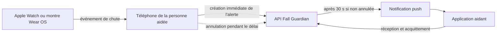
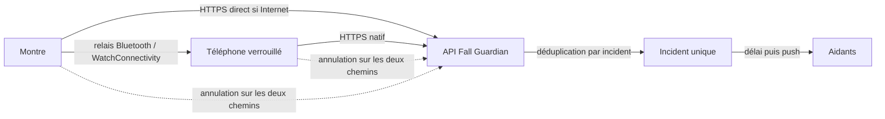

# Fall Guardian — documentation fonctionnelle et technique

> État de référence au 24 juillet 2026.
>
> Ce document décrit séparément ce qui existe sur `main`, les limites connues et
> ce qui reste à construire. Il constitue la source de vérité produit et
> architecture du projet.

## 1. Objectif du produit

Fall Guardian aide une personne à risque de chute et ses aidants.

Le système doit :

1. détecter une chute possible depuis une Apple Watch ou une montre Wear OS ;
2. avertir immédiatement la personne et lui laisser une courte possibilité
   d'indiquer qu'elle va bien ;
3. transmettre l'incident même si le téléphone est verrouillé et l'application
   n'est pas affichée ;
4. prévenir les aidants si l'incident n'est pas annulé ;
5. montrer aux aidants l'état de l'incident et qui le prend en charge ;
6. conserver un historique fiable.

Fall Guardian ne remplace pas les fonctions natives Apple/Android d'appel aux
services d'urgence. À ce jour, l'application prévient des aidants enregistrés ;
elle n'appelle pas automatiquement les services d'urgence et n'envoie pas de
SMS.

## 2. Légende

| Marqueur | Signification |
| --- | --- |
| ✅ | Disponible sur `main` |
| 🟡 | Développé dans une pull request ouverte, pas encore sur `main` |
| 🔴 | À implémenter |
| ⚠️ | Limite ou risque connu |

## 3. Vue d'ensemble

### Système actuel



La montre détecte la chute, puis transmet l'événement au téléphone. L'application
de la personne aidée enregistre immédiatement l'alerte sur le serveur. Le serveur
conserve une fenêtre d'annulation de 30 secondes. À son expiration, il notifie
les aidants liés à la personne.

Ce parcours fonctionne bien lorsque le code Flutter du téléphone peut démarrer
et joindre le serveur. Il n'offre pas encore toutes les garanties requises quand
l'application est arrêtée, après un redémarrage, ou lorsque la montre est seule.

### Architecture cible



La montre tentera deux chemins avec le même identifiant d'incident :

- envoi direct si elle possède du Wi-Fi ou une connexion cellulaire ;
- relais par le téléphone si celui-ci est à portée et possède Internet.

Le premier envoi reçu créera l'incident. Les suivants seront dédupliqués.
L'ouverture de l'application ne devra jamais être nécessaire.

## 4. Composants

| Composant | Technologie | Rôle |
| --- | --- | --- |
| Application personne aidée | Flutter, iOS et Android | Configuration, réception des événements montre, état de l'alerte, annulation, historique local |
| Application aidant | Flutter, iOS et Android | Association avec une personne, réception push, alertes actives, historique, acquittement |
| Apple Watch | Swift/watchOS | Détection de chute, interface locale, transmission à l'iPhone |
| Montre Wear OS | Kotlin/Wear OS | Détection par accéléromètre, interface locale, transmission au téléphone Android |
| API | Symfony 7.4, API Platform, PostgreSQL | Identités, associations, incidents, délai d'annulation, notifications et historique |
| Notifications | Firebase Cloud Messaging | Transmission des alertes aux téléphones des aidants |

## 5. Fonctionnalités actuelles

### 5.1 Application de la personne aidée

- ✅ enregistrement sécurisé du téléphone auprès de l'API ;
- ✅ réception d'un événement de chute venant de la montre ;
- ✅ création d'un `clientAlertId` unique ;
- ✅ enregistrement immédiat de l'alerte auprès du serveur ;
- ✅ compte à rebours local de 30 secondes ;
- ✅ annulation locale et demande d'annulation au serveur ;
- ✅ ajout différé de la position GPS quand elle devient disponible ;
- ✅ nouvelle tentative locale si le premier enregistrement échoue ;
- ✅ reprise du compte à rebours après suspension du timer Flutter ;
- ✅ historique local des détections et de leur résultat ;
- ✅ conservation explicite d'une annulation non confirmée par le serveur ;
- ✅ affichage d'un avertissement si les aidants peuvent déjà être prévenus ;
- ⚠️ la position n'est pas exigée pour créer l'alerte : elle peut arriver après ;
- ⚠️ un ancien texte Android parle encore d'un SMS, alors qu'aucun SMS n'est
  envoyé ;
- ⚠️ le relais réseau vers l'API dépend encore de Flutter.

Depuis la fusion de la
[#74](https://github.com/thlaure/Fall-Guardian/pull/74), un deuxième événement
ne relance plus le délai tant qu'un incident est actif. La même échéance est
conservée malgré les événements dupliqués.

### 5.2 Application aidant

- ✅ enregistrement sécurisé du téléphone aidant ;
- ✅ enregistrement du jeton de notification push ;
- ✅ association à une personne via un code d'invitation ;
- ✅ prise en charge de plusieurs personnes aidées ;
- ✅ stockage durable des notifications reçues ;
- ✅ déduplication d'une même alerte présentée plusieurs fois ;
- ✅ écran d'alerte active ;
- ✅ envoi d'un accusé de réception au serveur ;
- ✅ acquittement d'une alerte ;
- ✅ historique des alertes ;
- ✅ liste des personnes suivies ;
- ✅ reprise des notifications reçues avant l'ouverture de l'interface ;
- ⚠️ l'écran affiche encore des coordonnées brutes et un identifiant technique ;
- ⚠️ « Acquitter » ne signifie pas clairement « je prends en charge » ;
- ⚠️ le premier acquittement clôt globalement l'alerte sans montrer clairement
  quel aidant intervient.

Depuis la fusion de la
[#73](https://github.com/thlaure/Fall-Guardian/pull/73), le chargement de
l'historique fonctionne après une erreur suivie d'une nouvelle tentative.

### 5.3 Apple Watch

Sur `main` :

- ✅ utilisation de `CMFallDetectionManager`, le mécanisme système Apple ;
- ✅ activation au démarrage de l'extension watchOS ;
- ✅ réception possible d'une chute en arrière-plan ;
- ✅ persistance et nouvelle tentative d'un événement non transmis ;
- ✅ détection personnalisée avec l'accéléromètre comme solution de repli
  lorsque l'app est ouverte ;
- ✅ transmission temps réel à l'iPhone avec WatchConnectivity ;
- ✅ transfert différé si le message temps réel ne passe pas ;
- ✅ compte à rebours et annulation sur la montre ;
- ✅ retransmission de l'annulation à l'iPhone ;
- ✅ intégration de la cible Watch dans le projet iOS principal ;
- ⚠️ un simple toucher peut annuler, ce qui favorise les annulations
  accidentelles ;
- ⚠️ pas d'envoi direct à l'API ;
- ⚠️ installation physique bloquée tant qu'Apple n'a pas approuvé la capacité
  Fall Detection pour l'identifiant de l'app ;
- ⚠️ comportement exact des résolutions Apple à valider sur une vraie montre.

Ces fonctions ont rejoint `main` avec la
[#75](https://github.com/thlaure/Fall-Guardian/pull/75).

### 5.4 Montre Wear OS

- ✅ service au premier plan pour surveiller l'accéléromètre en continu ;
- ✅ détection basée sur chute libre, impact et changement d'inclinaison ;
- ✅ redémarrage du service après démarrage de la montre ;
- ✅ compte à rebours et annulation locale ;
- ✅ message immédiat au téléphone Android ;
- ✅ donnée urgente persistée dans le Data Layer en solution de repli ;
- ⚠️ pas d'envoi direct à l'API ;
- ⚠️ si le processus de l'app téléphone est tué, Android peut afficher une
  notification, mais l'enregistrement serveur attend encore le démarrage de
  l'activité Flutter.

### 5.5 API et serveur

- ✅ identité distincte pour téléphone de personne aidée et téléphone aidant ;
- ✅ authentification par jeton d'appareil, stocké sous forme de hash HMAC ;
- ✅ invitations et liens entre personnes aidées et aidants ;
- ✅ création idempotente d'une alerte pour un appareil et un `clientAlertId` ;
- ✅ fenêtre d'annulation serveur de 30 secondes ;
- ✅ planification différée de l'envoi avec Symfony Messenger ;
- ✅ annulation avant l'échéance ;
- ✅ ajout différé de la localisation ;
- ✅ envoi push à tous les aidants actifs liés ;
- ✅ suivi d'une tentative d'envoi pour chaque aidant ;
- ✅ statuts d'incident et historique ;
- ✅ accusé de réception push idempotent ;
- ✅ acquittement aidant idempotent ;
- ✅ délai prévu de 15 secondes pour la réception push ;
- ✅ délai prévu de 60 secondes pour l'acquittement ;
- ⚠️ l'escalade automatique après ces délais reste incomplète ;
- ⚠️ la déduplication est actuellement liée à l'appareil, pas à la personne.

## 6. Cycle de vie actuel d'une alerte

### 6.1 Détection et création

1. La montre détecte une chute possible.
2. Elle crée ou transmet un horodatage de chute.
3. Le téléphone crée un `clientAlertId`.
4. Le téléphone envoie immédiatement l'alerte à l'API, sans attendre la fin du
   compte à rebours.
5. Le serveur enregistre :
   - l'heure de réception ;
   - l'échéance d'annulation, 30 secondes plus tard ;
   - l'état initial `received`.
6. Le serveur programme le traitement après l'échéance.
7. La localisation est ajoutée plus tard si disponible.

Le compte à rebours local sert à l'interface et comme solution de repli si le
premier appel échoue. Il ne doit pas provoquer un deuxième enregistrement si le
serveur connaît déjà l'alerte.

### 6.2 Annulation

1. La personne indique qu'elle va bien sur la montre ou le téléphone.
2. Les timers locaux s'arrêtent.
3. Le téléphone demande l'annulation au serveur.
4. Le serveur accepte uniquement si l'alerte est encore `received` et si
   l'échéance n'est pas dépassée.
5. Sans confirmation serveur, l'interface conserve l'état
   `cancellationPending` et avertit que des aidants peuvent être contactés.

Une annulation après l'échéance ne doit pas être présentée comme une annulation
réussie. Dans l'architecture cible, elle deviendra une mise à jour « personne en
sécurité ».

### 6.3 Notification

1. À l'expiration du délai, le serveur réclame l'alerte pour traitement.
2. Il recherche tous les aidants actifs liés à la personne.
3. Il crée une tentative d'envoi par aidant.
4. Il transmet la notification via Firebase Cloud Messaging.
5. L'alerte devient `sent`, `partially_sent` ou `failed`.
6. L'app aidant transmet un reçu lorsqu'elle traite la notification.
7. Un aidant peut acquitter l'alerte.

Un fournisseur push qui accepte un message ne prouve pas que le téléphone l'a
reçu. Le reçu de l'app et la prise en charge sont donc deux états distincts.

## 7. États serveur actuels

| État | Sens |
| --- | --- |
| `received` | Alerte créée, encore annulable |
| `dispatching` | Envoi aux aidants en cours |
| `sent` | Toutes les notifications prévues ont été acceptées par le fournisseur |
| `partially_sent` | Une partie des notifications a échoué |
| `failed` | Aucun envoi prévu n'a abouti |
| `cancelled` | Annulation confirmée avant l'échéance |
| `acknowledged` | Au moins un aidant a acquitté l'alerte |

À terme, l'interface devra distinguer clairement :

```text
détectée
→ enregistrée sur le serveur
→ annulée
ou
→ envoyée
→ reçue
→ prise en charge
→ résolue
```

## 8. Connectivité et comportement

### Comportement actuel

| Situation | Résultat actuel |
| --- | --- |
| Montre à portée, téléphone avec Internet, apps actives | Parcours complet |
| Montre sans Wi-Fi, téléphone à portée avec réseau mobile | Relais montre → téléphone possible |
| iPhone verrouillé, app iOS en arrière-plan | Réveil natif observé en simulateur ; test physique requis |
| App téléphone Android visible ou processus vivant | Relais possible |
| Processus Android tué | Notification locale possible, création serveur non garantie |
| Montre seule avec Wi-Fi/cellulaire | Pas d'envoi direct aujourd'hui |
| Aucun réseau sur montre et téléphone | Transmission impossible ; événement local seulement |
| iPhone redémarré avant premier déverrouillage | WatchConnectivity peut être retardé |
| App explicitement forcée à l'arrêt | Garanties système réduites |

Le cas du jardin, avec la montre sans Wi-Fi mais l'iPhone sur la personne,
doit fonctionner ainsi :

```text
montre
→ Bluetooth / WatchConnectivity
→ iPhone verrouillé
→ réseau mobile de l'iPhone
→ serveur
```

Le Wi-Fi de la maison n'est pas nécessaire. Une Apple Watch cellulaire n'est
nécessaire que si la personne peut s'éloigner sans son iPhone.

### Garantie physique

Aucun logiciel ne peut transmettre si ni la montre ni le téléphone ne disposent
d'un chemin réseau ou radio. Dans ce cas, l'alarme locale, la persistance et les
nouvelles tentatives sont les seules protections possibles.

Les fonctions Apple Fall Detection et Emergency SOS restent une couche de
sécurité native indépendante de Fall Guardian.

## 9. Données et sécurité

### Identité

Le serveur reconnaît actuellement :

- une identité stable par personne protégée ;
- les appareils `protected_person` rattachés à cette identité ;
- les appareils `caregiver` ;
- les liens actifs entre eux ;
- les jetons push des aidants.

Les jetons d'authentification ne sont pas stockés en clair. Les secrets,
certificats, profils de signature et fichiers Firebase privés ne doivent jamais
être ajoutés au dépôt.

### Contrat d'incident

Le contrat de création accepte maintenant :

```text
clientAlertId
fallTimestamp
cancelled: true | false
revision
detectionSource
resolution
locale
latitude et longitude (optionnelles)
```

`revision`, `detectionSource` et `resolution` restent optionnels pour préserver
la compatibilité avec les applications déjà installées. Leurs valeurs par
défaut sont respectivement `1`, `assisted_phone` et `unknown`.

Le serveur retourne notamment :

```text
receivedAt
cancelDeadlineAt
```

Les doublons sont identifiés par personne protégée + `clientAlertId`. Une révision
plus récente met à jour les métadonnées de l'incident sans recréer l'alerte ni
redéclencher la notification. Une annulation portant une révision plus ancienne
que celle déjà enregistrée est refusée. Les aidants et l'historique sont
retrouvés au niveau de la personne, même lorsque l'incident provient d'un autre
appareil compagnon. L'enrôlement sécurisé permettant à une montre réelle de
rejoindre cette identité reste à implémenter.

Tous les écrans devront utiliser `cancelDeadlineAt` comme échéance autoritative.

### API actuelle

Principaux points d'entrée :

```text
POST   /api/v1/devices/register
POST   /api/v1/fall-alerts
GET    /api/v1/fall-alerts/{id}
POST   /api/v1/fall-alerts/{clientAlertId}/cancel
POST   /api/v1/fall-alerts/{clientAlertId}/location
POST   /api/v1/fall-alerts/{id}/receipt
POST   /api/v1/fall-alerts/{id}/acknowledge
POST   /api/v1/invites
POST   /api/v1/invites/{code}/accept
POST   /api/v1/caregiver/push-token
GET    /api/v1/caregiver/alerts
GET    /api/v1/caregiver/protected-persons
GET    /api/v1/protected/linked-caregivers
DELETE /api/v1/protected/linked-caregivers/{id}
GET    /health
```

La documentation OpenAPI locale est accessible sur
`http://localhost:8002/docs`.

## 10. Ce qui a été vérifié

- ✅ tests unitaires, intégration et scénarios Behat du backend ;
- ✅ enregistrement des deux types d'appareils ;
- ✅ invitations, acceptation et cas invalides ;
- ✅ création idempotente d'alerte ;
- ✅ annulation et validation des coordonnées ;
- ✅ distribution push et historique ;
- ✅ reçus et acquittements idempotents ;
- ✅ tests Flutter et analyse statique des applications mobiles ;
- ✅ lint, tests et build Wear OS ;
- ✅ analyse, build et tests watchOS ;
- ✅ chaîne Watch simulée → iPhone → Flutter ;
- ✅ lancement/réveil de l'app iPhone en arrière-plan observé en simulateur ;
- ⚠️ `transferUserInfo` et le comportement téléphone verrouillé nécessitent de
  vrais appareils ;
- ⚠️ la simulation système Apple d'une chute rencontre une erreur de parsing
  Core Motion Simulator ;
- ⚠️ l'approbation Apple Fall Detection est encore en attente.

## 11. Changements récemment fusionnés

| PR | Contenu | État fonctionnel |
| --- | --- | --- |
| [#73](https://github.com/thlaure/Fall-Guardian/pull/73) | Rechargement de l'historique aidant après erreur | ✅ Fusionnée sur `main` |
| [#74](https://github.com/thlaure/Fall-Guardian/pull/74) | Un seul délai pour un incident actif et correction du texte iOS | ✅ Fusionnée sur `main` |
| [#75](https://github.com/thlaure/Fall-Guardian/pull/75) | Détection Apple en arrière-plan | ✅ Fusionnée sur `main`, validation physique en attente d'Apple |

Les changements d'architecture ci-dessous peuvent maintenant partir de cette
base commune.

## 12. Problèmes connus

### Fiabilité

- 🔴 la montre ne contacte pas directement le serveur ;
- 🔴 les relais natifs téléphone dépendent encore de Flutter ;
- 🔴 le cas Android avec processus tué n'est pas sûr ;
- 🔴 la file hors connexion n'est pas unifiée et durable de bout en bout ;
- 🔴 le serveur déduplique par appareil, insuffisant si montre et téléphone
  utilisent des identités différentes ;
- 🔴 la politique de nouvelle notification sans réponse aidant est incomplète ;
- ⚠️ l'heure de départ du délai diffère entre certaines interfaces montre et le
  serveur ;
- ⚠️ une alerte tardive et une annulation tardive n'ont pas encore une règle
  partagée par tous les composants.

### Expérience personne aidée

- 🔴 remplacer le texte Android restant qui mentionne un SMS ;
- 🔴 remplacer l'annulation par simple toucher par un gros bouton
  « Je vais bien » avec appui long d'environ 1,5 seconde et retour haptique ;
- 🔴 afficher des états utiles :
  « transmission en cours », « alerte enregistrée », « aidants avertis »,
  « hors connexion » ;
- 🔴 localiser les écrans montre ;
- 🔴 expliquer clairement une annulation trop tardive ;
- ✅ empêcher un événement dupliqué de redémarrer le compte à rebours.

### Expérience aidant

- 🔴 remplacer « Acquitter » par des actions compréhensibles :
  « J'ai vu », « Je m'en occupe », « Personne en sécurité »,
  « Secours contactés » ;
- 🔴 montrer qui prend l'incident en charge ;
- 🔴 afficher nom, carte, adresse, précision et heure de la position ;
- 🔴 ajouter des actions d'appel et d'itinéraire ;
- 🔴 mettre à jour la position en direct sur un écran déjà ouvert ;
- 🔴 présenter le nom de la personne avant les identifiants techniques ;
- 🔴 expliquer l'absence de réponse et les nouvelles tentatives.

### Produit, sécurité et conformité

- 🔴 définir et tester la politique de faux positifs ;
- 🔴 valider les résolutions Apple sur une montre physique :
  `rejected`, `unresponsive`, `dismissed`, `confirmed` ;
- 🔴 documenter clairement que le service ne contacte pas automatiquement les
  secours ;
- 🔴 finaliser les règles de conservation des données et de suppression ;
- 🔴 faire valider le parcours médical et d'urgence avant commercialisation.

## 13. Architecture cible détaillée

### 13.1 Identité compagnon

Créer une identité de personne protégée stable et des identités compagnon à
portée limitée pour les montres. Ne jamais copier le jeton complet du téléphone
sur la montre.

Le serveur dédupliquera sur :

```text
protectedPersonId + clientAlertId
```

et non plus sur :

```text
deviceId + clientAlertId
```

### 13.2 Double transport

Pour chaque incident :

1. la montre persiste l'incident avant tout envoi ;
2. elle tente immédiatement HTTPS si Internet est disponible ;
3. elle tente en parallèle le relais vers le téléphone ;
4. le téléphone persiste puis envoie avec du code natif ;
5. le serveur accepte le premier message et déduplique les autres ;
6. l'annulation emprunte elle aussi les deux chemins ;
7. chaque composant conserve et retente tant que le serveur n'a pas confirmé.

Implémentation prévue :

- watchOS : `URLSession` + file persistante + WatchConnectivity ;
- iOS : `URLSession` natif + file persistante, indépendante de Flutter ;
- Wear OS : HTTPS direct + Data Layer ;
- Android : `WearableListenerService` + travail natif persistant/expéditif.

### 13.3 Incidents hors connexion

- chute non annulée reçue après le délai : notification immédiate aux aidants ;
- chute annulée hors connexion : synchronisation de l'historique sans prévenir
  les aidants ;
- messages reçus dans le désordre : la révision la plus élevée gagne ;
- absence de réseau : alarme locale, état « hors connexion », persistance et
  nouvelles tentatives.

### 13.4 Prise en charge aidant

Évolution de l'état métier :

```text
push envoyé
→ reçu par téléphone
→ vu par aidant
→ pris en charge par un aidant identifié
→ personne en sécurité ou secours contactés
```

Politique proposée :

1. notifier tous les aidants ;
2. attendre un reçu pendant 15 secondes, puis retenter si nécessaire ;
3. sans prise en charge après 60 secondes, renotifier et escalader ;
4. informer la personne aidée de l'état ;
5. ne jamais arrêter silencieusement l'escalade.

## 14. Plan d'implémentation

### Phase 0 — stabiliser l'existant

- ✅ PR #73, #74 et #75 fusionnées après CI ;
- corriger le texte SMS Android restant ;
- ✅ compte à rebours conservé lors des événements dupliqués ;
- tester iPhone verrouillé + vraie Apple Watch ;
- tester Android verrouillé, processus supprimé et redémarrage ;
- enregistrer les résultats dans cette documentation.

### Phase 1 — contrat et modèle serveur

- ✅ ajouter l'identité stable de personne protégée et le support serveur de
  plusieurs appareils compagnons ;
- créer l'enrôlement sécurisé d'une montre ;
- dédupliquer par personne + incident ;
- ✅ ajouter `revision`, `detectionSource` et `resolution` sans casser les anciens
  clients ; `locale` existait déjà ;
- ✅ retourner l'échéance serveur autoritative ;
- 🟡 définir les règles d'événements tardifs et désordonnés : révisions plus
  récentes et annulations anciennes couvertes, transitions complètes restantes ;
- 🟡 ajouter tests unitaires, intégration et contrats au fil des incréments.

### Phase 2 — relais natif téléphone

- implémenter file persistante et transport natif iOS ;
- implémenter réception et transport natifs Android ;
- transmettre sans ouvrir Flutter ;
- synchroniser l'état vers Flutter lorsqu'il démarre ;
- couvrir verrouillage, app tuée, redémarrage et absence réseau.

### Phase 3 — envoi direct montre

- provisionner une identité compagnon sur chaque montre ;
- ajouter envoi HTTPS et file persistante watchOS ;
- ajouter envoi HTTPS et file persistante Wear OS ;
- lancer direct et relais en parallèle ;
- synchroniser création, confirmation et annulation.

### Phase 4 — UX de sécurité

- remplacer l'annulation accidentelle par appui long ;
- unifier les états et l'échéance sur montre et téléphone ;
- afficher clairement la connectivité ;
- améliorer écran aidant, carte, appels et prise en charge ;
- localiser toutes les interfaces.

### Phase 5 — escalade et exploitation

- automatiser les nouvelles tentatives selon reçus et prise en charge ;
- ajouter supervision des incidents bloqués et des échecs push ;
- définir métriques, journaux et alertes techniques ;
- tester charge, pertes réseau, doublons et désordre ;
- finaliser sécurité, confidentialité et conformité.

## 15. Matrice minimale d'acceptation

Chaque plateforme doit couvrir au minimum :

| Scénario | Résultat attendu |
| --- | --- |
| Montre avec Internet, téléphone absent | Création directe, délai unique, notification |
| Montre sans Internet, téléphone verrouillé avec Internet | Relais natif, sans ouverture de l'app |
| Direct et relais simultanés | Un seul incident |
| Même chute transmise plusieurs fois | Même identifiant et même échéance |
| Annulation avant échéance | Aucun aidant prévenu |
| Annulation reçue avant ancien message de chute | L'incident ne ressuscite pas |
| Chute hors connexion non annulée | Alerte immédiate au retour réseau |
| Chute hors connexion annulée | Historique synchronisé, aucun push |
| Position refusée ou lente | Alerte créée sans blocage |
| Téléphone redémarré | File reprise automatiquement |
| App forcée à l'arrêt | Chemin direct montre utilisé si disponible |
| Aucun réseau | Alarme locale et état hors connexion |
| Push non reçu | Nouvelle tentative/escalade |
| Aucun aidant ne prend en charge | Renotification et escalade visible |

Les tests physiques doivent inclure :

- iPhone verrouillé dans une poche ;
- Android verrouillé avec processus supprimé ;
- montre hors Wi-Fi mais téléphone en 4G/5G ;
- montre cellulaire sans téléphone ;
- perte et retour réseau pendant le délai ;
- chute suivie d'une annulation presque simultanée ;
- plusieurs aidants et plusieurs appareils.

## 16. Développement local

Depuis la racine :

```sh
make help
make status
make quality
```

Contrôles ciblés :

```sh
make quality-api
make quality-assisted
make quality-caregiver
make quality-wear-os
make quality-watchos
```

API locale :

```text
Base :          http://localhost:8002/api/v1
Documentation : http://localhost:8002/docs
Santé :         http://localhost:8002/health
```

Le backend possède une fausse boîte de notifications pour les essais locaux.
Les commandes exactes d'installation et d'exécution restent documentées dans le
README de chaque projet.

## 17. Décisions encore à valider

1. Quelle règle appliquer à chaque résolution système Apple :
   `confirmed`, `dismissed`, `unresponsive`, `rejected` ?
2. Qui reçoit une nouvelle notification si aucun aidant ne prend en charge ?
3. Après combien de temps faut-il escalader et de quelle façon ?
4. Une annulation tardive signifie-t-elle « personne en sécurité » ou
   « faux positif » ?
5. Combien de temps conserver incidents, positions et journaux techniques ?
6. Quelles fonctions sont disponibles sans consentement de localisation ?
7. Quel parcours guidera un aidant vers les services d'urgence locaux ?
8. Quelle langue est autoritative quand montre et téléphone diffèrent ?
9. Quel mécanisme permet de révoquer une montre perdue ?
10. Quelle promesse commerciale peut être formulée sans présenter le système
    comme un remplacement des services d'urgence ?

## 18. Règles de mise à jour de ce document

Toute PR qui modifie un parcours majeur doit mettre à jour ce fichier si elle
change :

- le comportement visible ;
- le cycle de vie d'une alerte ;
- les garanties hors connexion ou arrière-plan ;
- un statut d'implémentation ;
- une limite connue ;
- le contrat entre montre, téléphone et serveur ;
- le plan de déploiement ou de validation.

Ne jamais décrire une fonctionnalité comme disponible avant sa fusion sur
`main`. Utiliser le statut 🟡 pour du code présent uniquement dans une PR.

## 19. Glossaire

| Terme | Définition |
| --- | --- |
| Personne aidée | Personne portant la montre et protégée par le système |
| Aidant | Proche ou professionnel recevant les alertes |
| Incident | Enregistrement unique correspondant à une chute possible |
| `clientAlertId` | Identifiant créé côté client et partagé entre les transports |
| Délai de grâce | Période de 30 secondes pendant laquelle l'alerte peut être annulée |
| Reçu | Confirmation que l'application aidant a traité la notification |
| Acquittement | Action actuelle indiquant qu'un aidant a vu l'alerte |
| Prise en charge | Futur état indiquant quel aidant agit |
| Relais | Transmission montre → téléphone → serveur |
| Envoi direct | Transmission montre → serveur sans téléphone |
